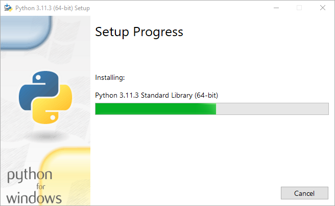
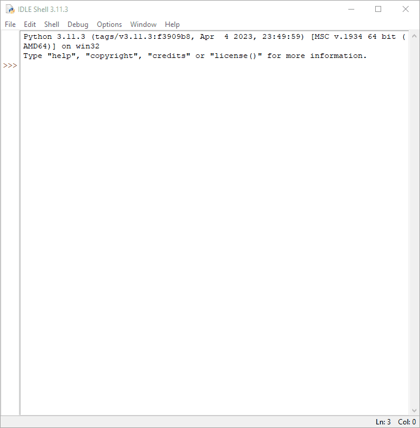

Title: Instalando o Python 3 no Windows
Slug: instalacao-windows
Template: page

Para instalar o Python no seu sistema operacional Windows, você precisa baixar o instalador. Acesse o site oficial [neste link](https://www.python.org/downloads/) e clique em download, como mostrado abaixo.

Isso fará o download do Python 3 para sitemas 64 bits. Para o instalador de 32 bits, acesse  e selecione o instalador de 32 bits apropriado, como mostrado abaixo.

Faça o download do instalador executável do Windows (32 ou 64 bits) e clique duas vezes nele para iniciar o assistente de instalação do python, como mostrado abaixo.

O processo de instalação é bem simples.  

1. Marque a opção "Add Python to PATH"  
2. Clique em "Install Now"

A tela abaixo será mostrada. Aguarde enquanto o instalador completa o processo de instalação.

Se tudo ocorrer bem, a próxima tela será mostrada. Clique em "Close".

Para verificar se a instalação do Python foi bem-sucedida, pesquise no menu iniciar por "cmd" e clique duas vezes para abri-lo.

Digite o seguinte comando:
    $ python --version
    Python 3.11.3

Este comando retornará a versão do python que está instalada em sua máquina. Agora digite:

    $ pip --version
    pip 22.3.1 from C:\Users\...\AppData\Local\Programs\Python\Python311\Lib\site-packages\pip (python 3.11)

Esse comando retornará a versão do pip que está instalada em sua máquina. O pip é o gerenciador de pacote do Python. Com ele você poderá adicionar novas funcionalidades ao seu Python.

## IDLE

O IDLE (Ambiente de Desenvolvimento e Aprendizagem Integrado) é um ambiente de desenvolvimento integrado (IDE) para Python. O instalador do Python para Windows contém o módulo IDLE por padrão.

O IDLE pode ser usado para executar uma única instrução, como o Python Shell, e também para criar, modificar e executar scripts Python. O IDLE fornece um editor de texto completo para criar scripts Python que incluem recursos como destaque de sintaxe, preenchimento automático e recuo inteligente. Ele também possui um depurador com recursos de etapas e pontos de interrupção.

Para iniciar o shell interativo IDLE, procure o ícone IDLE no menu Iniciar e clique duas vezes nele.

Isso abrirá o IDLE, onde você pode escrever o código Python e executá-lo como mostrado abaixo.

Parabéns, agora o Python, o pip e o Idle já estão instalados em seu sistema Windows.

Happy Hacking! ^-^
